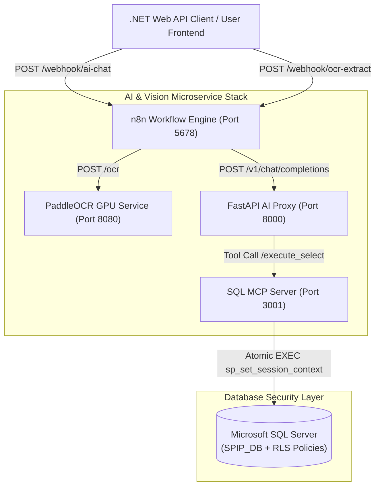

# 🤖 SPIP AI — Smart Procurement Intelligence Platform

[](https://github.com/Smart-Procurement-Intelligence-Platform)
[](https://github.com/Smart-Procurement-Intelligence-Platform)
[](https://github.com/Smart-Procurement-Intelligence-Platform)
[](https://github.com/Smart-Procurement-Intelligence-Platform)
[](https://github.com/Smart-Procurement-Intelligence-Platform)
[](https://github.com/Smart-Procurement-Intelligence-Platform)

> **SPIP AI** is an enterprise-grade, multi-tenant financial intelligence and automated procurement management platform. It seamlessly combines **GPU-accelerated bilingual document OCR (Arabic & English)**, **n8n workflow orchestration**, **OpenAI-compatible multi-turn AI Agent proxies**, and **SQL Server kernel-level Row-Level Security (RLS)** into a unified ecosystem.

---

## 🌟 Executive Summary & Value Proposition

Traditional procurement systems suffer from manual invoice data entry errors, delayed 3-way matching audits, and rigid reporting interfaces. **SPIP AI** solves these challenges by providing:

1. ⚡ **99%+ Accurate Bilingual OCR**: Automatically parses unstructured Arabic and English PDF/Image invoices into normalized JSON schemas within seconds.
2. 💬 **Conversational AI Business Intelligence**: Enables non-technical decision-makers to query complex procurement metrics using natural language.
3. 🔒 **Zero-Trust Row-Level Security (RLS)**: Enforces database kernel-level data isolation. Regular users strictly access their own records, while System Administrators enjoy company-wide BI analytics.
4. 🛠️ **Model Context Protocol (MCP) Integration**: Connects enterprise Large Language Models (LLMs) to Microsoft SQL Server via atomic session context execution.

---

## 🏛️ System Architecture



---

## 📦 Core Component Microservices

### 1️⃣ 📷 SPIP Document OCR Pipeline
- **Repository**: [`spip-paddleocr-service`](https://github.com/MahmoudNour2003/spip-paddleocr-service)
- **Tech Stack**: Python 3.10, FastAPI, PaddleOCR, PyMuPDF, CUDA 11.8/12.1
- **Functionality**: Renders PDF pages to high-DPI images, normalizes PNG transparency layers, and extracts text line bounding boxes for bilingual Arabic & English invoices with CUDA GPU acceleration.

### 2️⃣ 🤖 SPIP Enterprise AI Proxy Server
- **Repository**: [`spip-ai-bi-proxy`](https://github.com/MahmoudNour2003/spip-ai-bi-proxy)
- **Tech Stack**: Python, FastAPI, Async Httpx, Pydantic v2, OpenAI API Spec
- **Functionality**: Middleware server implementing OpenAI `/v1/chat/completions` compatibility. Features **multi-turn tool execution loops (up to 3 turns)**, dynamic SQL schema injection, and user ID regex session parsing.

### 3️⃣ 🗄️ SPIP SQL Server MCP Server
- **Repository**: [`spip-sql-mcp-server`](https://github.com/MahmoudNour2003/spip-sql-mcp-server)
- **Tech Stack**: Node.js, TypeScript, Express, `@modelcontextprotocol/sdk`, `node-mssql`
- **Functionality**: Model Context Protocol (MCP) server offering 5 database tools (`execute_select`, `list_tables`, `describe_table`, `get_relationships`, `get_database_info`). Combines `sp_set_session_context` with `SELECT` queries in single atomic SQL batches to enforce database kernel-level Row-Level Security.

### 4️⃣ ⚡ SPIP n8n Workflow Orchestration Engine
- **Tech Stack**: n8n, Node.js, Webhooks, LangChain Agent Nodes
- **Functionality**: Manages workflow execution, HTTP header authentication (`X-API-Key`), JSON response formatting, and error handling for OCR and Chat AI endpoints.

### 5️⃣ 🏛️ SPIP Core Web API Backend
- **Repository**: [`Graduation_Project`](https://github.com/MahmoudAbd-El-kader-123/Graduation_Project)
- **Tech Stack**: .NET 8, C#, ASP.NET Core Web API, EF Core 8, Hangfire, ASP.NET Identity, JWT
- **Functionality**: Clean Architecture backend managing core business domains (Invoices, Purchase Orders, Vendors, Products, Discrepancies), Hangfire background processing, claim-based RBAC, and EF Core RLS migrations.

---

## 🔒 Enterprise Security & Privacy Guardrails

```mermaid
sequenceDiagram
    autonumber
    actor User as Authenticated User (UserId: 5)
    participant API as .NET API Backend
    participant N8N as n8n Webhook
    participant MCP as SQL MCP Server
    participant DB as SQL Server (RLS)

    User->>API: Ask Question ("Show my top invoices")
    API->>N8N: POST /webhook/ai-chat (Header: X-API-Key, Body: {userId: 5})
    N8N->>MCP: execute_select(sql, userId: 5)
    MCP->>DB: EXEC sp_set_session_context @key=N'UserId', @value=5; SELECT ...
    DB-->>MCP: Returns ONLY rows belonging to User 5
    MCP-->>N8N: Processed JSON Rows
    N8N-->>API: Natural Language Answer
    API-->>User: Executive Response
```

- **Database Kernel RLS**: Security policies (`Security.InvoiceSecurityPolicy` and `Security.POSecurityPolicy`) evaluate predicates against `SESSION_CONTEXT(N'UserId')` and `SESSION_CONTEXT(N'IsAdmin')`.
- **AST SQL Query Validation**: Blocks mutating statements (`INSERT`, `UPDATE`, `DELETE`, `DROP`, `ALTER`) to ensure read-only execution safety.
- **Webhook Authentication**: All webhooks require valid `X-API-Key` headers for incoming requests.

---

## 🚀 Quick Start Deployment Guide

### 1. Reverse SSH Database Tunnel (On Local PC)
```powershell
# Setup SSH connection to Cloud VM
iwr "https://lightning.ai/setup/ssh-windows?t=02753ac1-e22c-4194-b552-d413ca3c3f1a&s=01kysxnzwagjdf5y3y51w85673" -useb | iex

# Allow SQL Server Port 1433 in Windows Firewall
New-NetFirewallRule -DisplayName "SQL Server Port 1433" -Direction Inbound -Protocol TCP -LocalPort 1433 -Action Allow

# Open Reverse Tunnel (Port 1433 -> LocalDB/SQL Server)
ssh -R 1433:127.0.0.1:1433 01kysxnzwagjdf5y3y51w85673
```

### 2. Launch All Microservices (On Cloud VM)
```bash
git clone https://github.com/MahmoudNour2003/enterprise-ai-ocr-stack.git
cd enterprise-ai-ocr-stack

# Grant script execution permissions
chmod +x *.sh

# Enable NVIDIA GPU Acceleration for PaddleOCR
./enable_gpu_ocr.sh

# Start All 4 Services Natively
./start_all_services.sh
```

---

## 🏥 Microservice Health Verification

| Endpoint | Target Port | Verification Command | Expected Status |
| :--- | :--- | :--- | :--- |
| **PaddleOCR GPU Service** | `8080` | `curl http://localhost:8080/health` | `{"gpu_enabled": true, "device": "gpu:0"}` |
| **SQL MCP Server** | `3001` | `curl http://localhost:3001/health` | `{"databaseConnected": true}` |
| **Enterprise AI Proxy** | `8000` | `curl http://localhost:8000/health` | `{"status": "healthy"}` |
| **n8n Dashboard** | `5678` | `curl http://localhost:5678` | `200 OK` |

---

## 👥 Authors & System Architecture Team

- **Mahmoud Nour** — *AI Infrastructure, LLM Middleware Proxy, MCP Server, GPU OCR Pipeline & DevOps*
- **Graduation Project Team** — *Enterprise .NET Core Backend, Domain Modeling, EF Core Migrations & UI*

---

## 📄 License

Distributed under the **MIT License**. See `LICENSE` for more information.
